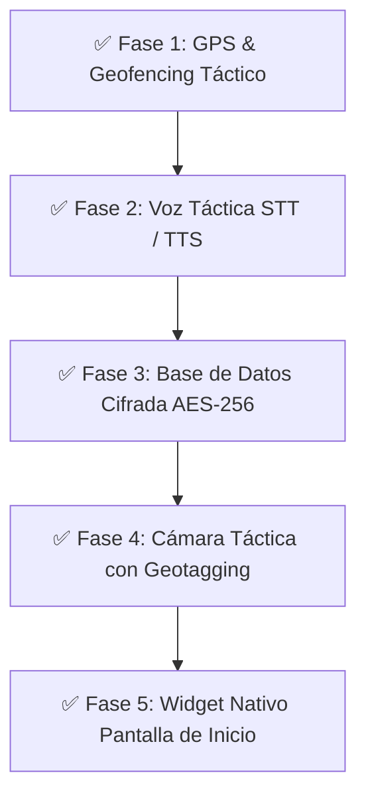

# 🛰️ COBALTO MOBILE — Autonomous Tactical Intelligence Platform

[](https://flutter.dev)
[](https://developer.android.com)
[](https://github.com)
[](https://github.com)

**COBALTO MOBILE** es una plataforma autónoma de inteligencia táctica, OSINT y monitoreo situacional diseñada para dispositivos Android. Funciona de manera **100% independiente en el dispositivo (Air-Gapped / Offline)** realizando scraping e ingesta local de noticias, o en modo **Enlace Estación Base** sincronizándose con el ecosistema central de COBALTO HUB.

---

## 🚀 Evolución Táctica Implementada (Las 5 Fases Completadas)



### 1. 🛰️ Geolocalización del Operador y Geocercas (`GpsService`)
- Integración de sensor GPS en tiempo real con cálculo de distancias Haversine.
- Marcador de radar pulsante verde en el mapa Leaflet C4I y botón de centrado inmediato `[ 📍 MI UBICACIÓN ]`.
- Disparo automático de alertas de proximidad en la barra de estado y superposición flotante HUD cuando un evento ocurre dentro del radio configurado.

### 2. 🎙️ Dictado por Voz (STT) y Lectura Táctica de Alertas (TTS) (`VoiceService`)
- Dictado por micrófono en español para la recolección de reportes HUMINT con indicación visual pulsante `🔴 ESCUCHANDO...`.
- Lectura por voz militar sintetizada (`flutter_tts`) de titulares y cuerpo de incidentes desde las tarjetas de alerta.

### 3. 🔒 Bóveda de Cifrado AES-256 en Hardware (`CryptoVaultService`)
- Custodia de clave Maestra de 256 bits protegida directamente en el **Android KeyStore por hardware**.
- Cifrado/descifrado transparente de reportes e información confidencial antes de almacenarse en la base de datos SQLite local.

### 4. 📷 Cámara Táctica con Estampado de Telemetría GPS (`TacticalCameraService`)
- Captura de fotos tácticas con estampado automático en píxeles de: Latitud/Longitud GPS, Hora UTC ZULU y Clasificación de Seguridad (`CONFIDENCIAL // COBALTO C4I`).
- Integración directa en la suite de reconocimiento (`ReconTab`).

### 5. 📱 Widget Nativo para Pantalla de Inicio en Android (`WidgetService`)
- Transmisión en tiempo real del nivel **DEFCON**, conteo de **alertas activas** y el **titular SitRep más reciente** a la pantalla de inicio del teléfono (`cobalto_widget_layout.xml`).

---

## 🏛️ Arquitectura de la Interfaz (9 Pestañas Tácticas)

| Icono | Pestaña | Propósito Táctico |
|---|---|---|
| 📰 | **SitRep** | Feed de novedades con filtrado por relevancia, persistencia SQLite `cobalto_edge.db` y exportación de tarjetas PNG optimizadas para Android. |
| 🗺️ | **Mapa** | Cartografía interactiva Leaflet (Modo Vectorial Oscuro / Satelital HD) con radar GPS del operador en vivo. |
| ⚠️ | **Alertas** | Sistema de criticidad de incidentes con avisos de geocerca y lectura por voz sintetizada (TTS). |
| 🎯 | **HUMINT** | Captura de reportes de campo con dictado por voz (STT), coordenadas GPS y sincronización de servidor. |
| 🛠️ | **Recon** | Kit OSINT (WHOIS, DNS, IP Geoloc, CVEs) y Cámara Táctica con estampado de telemetría. |
| 🔍 | **OFAC** | Verificador de sanciones globales y trazabilidad Blockchain. |
| 🤖 | **IA Chat** | Consola táctica interactiva conectada a Ollama / Asistente Local. |
| 📡 | **Vivo** | Telemetría de sismos USGS y sensores situacionales. |
| ⚙️ | **Ajustes** | Centro de control de parámetros con botones auditores de Bóveda AES-256, GPS, TTS, Cámara y Widget. |

---

## 📋 Requisitos de Sistema

- **SDK de Flutter:** 3.19.0 o superior
- **Dart SDK:** 3.3.0 o superior
- **SO Objetivo:** Android 8.0 (API 26) en adelante
- **Herramientas de Compilación:** Java JDK 17, Android Studio / Gradle

---

## ⚙️ Instalación y Compilación

### 1. Clonar el repositorio del cliente móvil
```bash
git clone https://github.com/tu-usuario/cobalto-mobile.git
cd cobalto-mobile
```

### 2. Obtener dependencias de Flutter
```bash
flutter pub get
```

### 3. Verificar sintaxis
```bash
flutter analyze
```

### 4. Compilar APK de Producción
```bash
flutter build apk --release
```
El instalador APK generado se ubicará en:
`build/app/outputs/flutter-apk/app-release.apk`

---

## 📄 Licencia y Seguridad
Uso reservado para investigación OSINT, análisis situacional y gestión de inteligencia operacional.  
**Desarrollado por el Ecosistema COBALTO HUB.**
