# 🛰️ COBALTO MOBILE — Autonomous Tactical Intelligence Platform

[](https://flutter.dev)
[](https://developer.android.com)
[](https://github.com)
[](https://github.com)
[](https://github.com)
[](https://github.com)
[](https://github.com)

**COBALTO MOBILE** es una plataforma autónoma de inteligencia táctica, OSINT y monitoreo situacional diseñada para dispositivos Android. Permite operar **independiente en el dispositivo (Offline / Air-Gapped)** realizando scraping e ingesta local de noticias, o en modo **Enlace Estación Base** sincronizándose con el ecosistema central de COBALTO HUB. En emergencias, opera sobre una **red mesh peer-to-peer cifrada (AEGIS)** sin infraestructura de red.

---

## 🚀 Evolución Táctica Implementada — v1.1.0 RELEASE

```mermaid
graph TD
    A["✅ Fase 1: GPS & Geofencing Táctico"] --> B["✅ Fase 2: Voz Táctica STT / TTS"]
    B --> C["✅ Fase 3: Bóveda Cifrada AES-256-GCM"]
    C --> D["✅ Fase 4: Cámara Telemetría Isolate"]
    D --> E["✅ Fase 5: Widget Nativo Pantalla Inicio"]
    E --> F["✅ Capacidad Táctica: Modo Sigilo (NVG)"]
    F --> G["✅ Capacidad Táctica: Escáner OCR Offline"]
    G --> H["✅ Capacidad Táctica: Dead Man's Switch (SOS)"]
    H --> I["⚡ Estabilización: Multi-Isolates & Anti-ANR"]
    I --> J["✅ Fase 6: Telemetría GPS en Vivo & HUD Cámara"]
    J --> K["✅ Fase 7: Sistema de Emergencias Integral"]
    K --> L["⚡ Optimización: Ciclo de Vida & Navegación Responsiva"]
    L --> M["✅ Fase 8: Blue Force Tracking (BFT) & Telemetría HUB"]
    M --> N["✅ Fase 9: AEGIS — Red Mesh P2P Offline"]
    N --> O["✅ Fase 10: AEGIS E2EE/TOFU — Cifrado Mesh"]
    O --> P["✅ Fase 11: Autodescubrimiento LAN UDP + Status Chip"]
    P --> Q["⚡ Fase 12: Arranque Instantáneo (< 150ms Cold-Start)"]
    Q --> R["🧹 Fase 13: Higiene de Datos Global (TextSanitizer)"]
    R --> S["🎙️ Fase 14: Voz Táctica Modulada (Pitch 0.92 + Prefijos)"]
```



---

### 1. 👁️ Modo Sigilo / Visión Nocturna (NVG) (`StealthService`)
- Interfaz táctica de **bajo perfil fotónico** con tonos rojos/negros monocromáticos (`0xFF080000`) para minimizar la firma de luz del operador en ambientes oscuros.
- Retroalimentación háptica silenciosa en patrones de código Morse según el nivel de alerta.

### 2. 🔤 Escáner OCR Táctico 100% Offline (`TacticalOcrService`)
- Procesamiento en el dispositivo utilizando **Google MLKit** para extraer instantáneamente texto, matrículas/placas, códigos de serie y coordenadas GPS desde fotografías o la galería de imágenes sin conexión a internet.

### 3. 🚨 Monitor de Hombre Muerto / Inmovilidad (`DeadManSwitchService`)
- Muestreo optimizado a **10 Hz** del acelerómetro para detectar impactos bruscos (>2.8G libre + gravedad) o caídas del operador.
- Desencadena una cuenta regresiva de emergencia de **30 segundos** con opción de cancelación manual antes de transmitir la señal de SOS a la estación base (endpoint `/api/sos`, con fallback al reporte HUMINT) y registro local cifrado del evento.

### 4. ⚡ Estabilización del Sistema & Aislamiento de Hilos (Isolates)
- **Procesamiento de Imágenes en Isolates (`compute`)**: La decodificación y estampado de telemetría GPS/UTC en fotos de cámara se ejecuta en Isolates secundarios, previniendo bloqueos del hilo principal (ANR).
- **Gestión de Memoria RAM**: Activación de `android:largeHeap="true"` y optimización de renderizado PNG (`pixelRatio: 2.0`) en el generador de fichas infográficas.
- **Android 14+ Foreground Service Compliance**: Declaración explícita de permisos de servicio en segundo plano (`FOREGROUND_SERVICE_DATA_SYNC`, `FOREGROUND_SERVICE_LOCATION`) para evitar terminaciones por el SO.

### 5. 📱 Widget Nativo para Pantalla de Inicio en Android (`WidgetService`)
- Transmisión en tiempo real del nivel **DEFCON**, conteo de **alertas activas** y el **titular SitRep más reciente** a la pantalla de inicio del teléfono (`cobalto_widget_layout.xml`).

### 6. 🛰️ Telemetría GPS en Vivo & HUD de Cámara Táctica (`GpsService`, `TacticalCameraService`)
- **Snapshot táctico unificado** (`TacticalSnapshot`): lat/lon, altitud, rumbo, velocidad (KT), precisión y timestamp UTC expuesto como `ValueNotifier` en vivo compartido por mapa, HUD, geocercas y SOS — con `distanceFilter: 5 m` para ahorrar batería.
- **Cámara táctica con HUD en vivo**: overlay de telemetría GPS en tiempo real, flash, conmutación de sensor y **linterna de emergencia** (torch).
- **Forense fotográfico**: cada captura genera un sidecar JSON con SHA-256, coordenadas y UTC, registra un `FieldReport` y se sube a `/api/humint/report`; sin fix, muestra **"SIN FIJACIÓN"** (nunca estampa coordenadas falsas).

### 7. 🆘 Sistema de Emergencias Integral (`EmergencyService`)
- **Botón PÁNICO global** con retención de 3 s (anti-activación accidental) que transmite SOS con telemetría fresca.
- **Coacción (Duress)**: contraseña camuflada en el login que entra con normalidad aparente mientras transmite un SOS silencioso.
- **Sirena de localización** (`EmergencyAlarmScreen`): estroboscopio rojo ~2.5 Hz, patrón háptico SOS, linterna, telemetría en vivo y cancelación explícita; el botón "atrás" del sistema queda **bloqueado** (PopScope).
- **Heartbeat de telemetría**: latido periódico (`/api/sos`) para que la base detecte la pérdida del operador.
- **Escalada a contacto**: sin ACK del servidor, intenta SMS y llamada al contacto de emergencia configurado.
- **Timeline forense** (`emergency_log` en SQLite v3) con registro de pánico, coacción, escaladas y cancelaciones.
- **Dead Man's Switch mejorado**: detección de caída + inmovilización + arrastre/transporte, foto de contexto automática y cancelación por cualquier toque.

### 8. 🔋 Gestión de Poder & 🧭 Navegación Responsiva
- **Ciclo de vida** (`PowerManagementService`): al pasar a segundo plano se suspende el stream GPS continuo y se restaura al volver; los servicios de seguridad (dead-man, heartbeat) permanecen activos.
- **Navegación responsiva**: la barra inferior muestra **5 módulos esenciales** (SitRep, Mapa, Alertas, IA Chat, Ajustes) con el resto disponible en un **cajón "MÓDULOS COBALTO C4I"**. En tabletas/apaisado (≥600 dp) se usa un **panel lateral** (`NavigationRail`).

### 9. 🔵 Blue Force Tracking — BFT (`BftService`)
- Telemetría continua de **GPS, batería y estado SOS** transmitida al COBALTO HUB mediante el endpoint `/api/bft/heartbeat`.
- La estación base recibe actualizaciones en tiempo real de **posición, identidad y vitalidad** de cada dispositivo de campo desplegado.
- Registro inmutable de eventos de desconexión para detección de pérdida de operador en el mapa de fuerzas propias del HUB.

### 10. 📡 AEGIS — Red Mesh P2P Offline (`AegisMeshService`)
- **Red de malla de emergencia** sobre **Bluetooth Low Energy (BLE)** y **Wi-Fi Direct**, operativa sin infraestructura de red (celular/WiFi/internet).
- **Sincronización táctica autónoma**: alertas, SITREPs y señales SOS se propagan peer-to-peer entre dispositivos COBALTO en el área de operaciones.
- **E2EE/TOFU**: cada par de dispositivos establece un canal cifrado de extremo a extremo con verificación de identidad **Trust On First Use** — sin servidor de llaves centralizado.
- **Resiliencia de emergencia**: si el canal BFT→HUB cae, AEGIS actúa como red de respaldo garantizando la entrega de señales SOS y datos críticos entre operadores.
- Implementado sobre el paquete `nearby_connections` (Google Nearby Connections API).

### 11. 📶 Autodescubrimiento LAN Zero-Conf & Status Chip Interactivo (`NetworkDiscoveryService`)
- **Autodescubrimiento Dual de 2 Capas**: Emite una sonda UDP Broadcast (puerto 8084) táctica con fallback a escaneo ultrarrápido de subred HTTP para enlazar automáticamente el teléfono con el HUB PC en < 1 segundo.
- **Chip de Enlace LAN Táctico (`_StatusStrip`)**: Muestra `🟢 HUB: IP` o `📱 AUTÓNOMO` en vivo con un botón de toque rápido para re-escaneos inmediatos y retroalimentación háptica.
- **Búsqueda Táctica en Cajón (`_AppDrawer`)**: Filtro de búsqueda en vivo dentro del menú lateral de 9 módulos para acceso instantáneo.

### 12. ⚡ Arquitectura de Arranque Instantáneo (< 150ms Cold-Start) (`BootScreen`, `main.dart`)
- **Inicialización Asíncrona No Bloqueante**: Refactorización completa de `main()` y `BootScreen` para ejecutar `runApp()` de forma inmediata, eliminando esperas síncronas que provocaban pantallas negras al abrir la app.
- **Carga Diferida de Servicios**: Los motores de GPS, Notificaciones, AEGIS Mesh y Telemetría inician en hilos asíncronos en segundo plano tras renderizar la interfaz.

### 13. 🧹 Higiene de Datos Global & UI Limpia (`TextSanitizer`)
- **Sanitización en Ingesta y Renderizado**: Purga automática de etiquetas HTML (`<p>`, `<div>`), entidades XML/HTML (`&quot;`, `&#8211;`), secuencias de escape Unicode (`\u00e1`), y fragmentos JSON sin parsear.
- **Integración Transversal**: Aplicado a tarjetas SitRep, vista detallada de noticias, notificaciones de sistema Android, widget nativo de pantalla de inicio e infografías PNG HD.

### 14. 🎙️ Motor de Voz Táctica C4I (`VoiceService`)
- **Modulación Autoritaria**: Timbre autoritario tipo C4I (`Pitch 0.92`, `SpeechRate 0.50`) para una pronunciación militar pausada sobre cascos o entornos ruidosos.
- **Introducciones Configurables**: Saludo de voz personalizable desde Ajustes (`Alerta COBALTO`, Directo al grano, por Nombre de Operador o Nivel de Amenaza).
- **Extracto Ejecutivo de Audio**: Envoltura corta de audio (máximo 80 caracteres adicionales) para evitar lecturas infinitas de artículos extensos.
- **Botón `🔊 ESCUCHAR`**: Lectura auditiva bajo demanda en las tarjetas de noticias.

### 15. 🔋 Gestión Eficiente de Recursos en Segundo Plano (Zero-Overhead)
- **Reutilización de Telemetría Compartida**: Si la posición GPS leída recientemente es fresca (≤45s), se reutiliza sin activar el hardware GPS.
- **Deduplicación de Alertas**: Ventana de 45 segundos para evitar repetición auditiva continua del mismo incidente.

---

## 🏛️ Arquitectura de la Interfaz (9 Módulos Tácticos)

La app expone **9 módulos tácticos**. En teléfonos, la barra inferior muestra los **5 esenciales** (SitRep, Mapa, Alertas, IA Chat, Ajustes) y el resto se alcanza desde el **cajón "MÓDULOS COBALTO C4I"** (icono ☰); en tabletas/apaisado el cuerpo cambia a panel lateral.

| Icono | Módulo | Propósito Táctico |
|---|---|---|
| 📰 | **SitRep** | Feed de novedades con filtrado por relevancia, persistencia SQLite `cobalto_edge.db` y exportación de tarjetas PNG HD optimizadas. |
| 🗺️ | **Mapa** | Cartografía interactiva Leaflet (Modo Vectorial Oscuro / Satelital HD) con radar GPS del operador en vivo y capa BFT de fuerzas propias. |
| ⚠️ | **Alertas** | Sistema de criticidad de incidentes con avisos de geocerca, notificaciones Android y lectura por voz sintetizada (TTS). |
| 🎯 | **HUMINT** | Captura de reportes de campo cifrados con dictado por voz (STT), coordenadas GPS y sincronización de servidor. |
| 🛠️ | **Recon** | Kit OSINT (WHOIS, DNS, IP Geoloc, CVEs), Escáner OCR Offline y Cámara Táctica HUD con telemetría en vivo. |
| 🔍 | **OFAC** | Verificador de sanciones globales, listas SDN y trazabilidad Blockchain en tiempo real. |
| 🤖 | **IA Chat** | Consola táctica interactiva con selección de personas (`GENERAL`, `ARES`, `MINERVA`, `NEXUS`), dictado por voz y lectura de respuestas. |
| 📡 | **Vivo** | Telemetría de vuelos comerciales/militares y sensores telúricos/térmicos en tiempo real (USGS / FIRMS). |
| ⚙️ | **Ajustes** | Centro de control con conmutador NVG, calibración del monitor de hombre muerto, **plan de emergencia** (contacto, heartbeat, código de coacción) y limpiador de caché. |

> **Franja de estado táctica**: bajo el AppBar se muestra el conmutador de sigilo (NVG), el estado de red AEGIS, y cuando aplica, la franja de vigilancia del dead-man y el banner de SOS.

---

## 🛡️ Seguridad

- **Cifrado de datos en reposo:** bóveda **AES-256-GCM** (autenticación AEAD) con clave maestra de 32 bytes generada aleatoriamente y custodiada en el Android Keystore / Secure Storage. Los datos cifrados usan formato versionado `ENCv2:`; los registros legacy se migran automáticamente.
- **AEGIS E2EE/TOFU:** cifrado de extremo a extremo en la red mesh — cada sesión P2P negocia llaves efímeras sin servidor centralizado.
- **Credenciales de operador:** se inyectan en tiempo de build mediante `--dart-define` (nunca embebidas en el repositorio) y la contraseña se persiste únicamente en Secure Storage, no en SharedPreferences en claro.
- **Autenticación:** el acceso exige un JWT emitido por `/api/login`. No existen tokens de override ni bypass para credenciales por defecto.
- **Transporte:** en builds de producción el tráfico en claro (HTTP) está prohibido por `network_security_config`; solo el build de DEBUG permite cleartext hacia la LAN de desarrollo. Para despliegues productivos use TLS/HTTPS.

---

## 📋 Requisitos de Sistema

- **SDK de Flutter:** 3.22 o superior (probado en **3.44 stable**)
- **Dart SDK:** 3.6 o superior (probado en **3.12.2**)
- **SO Objetivo:** Android 8.0 (API 26) en adelante
- **Herramientas de Compilación:** Java JDK 17, Android Studio / Gradle 8.x

---

## ⚙️ Instalación y Compilación

### 1. Clonar el repositorio del cliente móvil
```bash
git clone https://github.com/zuluetaulianov-eng/cobalto_mobile.git
cd cobalto_mobile
```

### 2. Obtener dependencias de Flutter
```bash
flutter pub get
```

### 3. (Opcional) Inyectar credenciales por defecto en tiempo de build
```bash
flutter build apk --release \
  --dart-define=COBALTO_DEFAULT_USERNAME=operador \
  --dart-define=COBALTO_DEFAULT_PASSWORD=tusecreto
```
Sin estos `--dart-define`, los campos de credenciales inician vacíos.

### 4. Verificar sintaxis
```bash
flutter analyze
```

### 5. Compilar APK de Producción
```bash
flutter build apk --release
```
El instalador APK generado se ubicará en:
`build/app/outputs/flutter-apk/app-release.apk`

---

## 📦 Dependencias Principales (v1.0.0)

| Paquete | Versión | Propósito |
|---|---|---|
| `flutter_secure_storage` | 10.3.1 | Bóveda AES-256 / Android Keystore |
| `geolocator` | 13.0.4 | GPS / BFT Telemetría |
| `nearby_connections` | 4.3.0 | AEGIS Mesh BLE + Wi-Fi Direct |
| `speech_to_text` | 7.4.0 | STT dictado HUMINT |
| `flutter_tts` | 4.2.5 | TTS síntesis de voz |
| `google_mlkit_text_recognition` | 0.14.0 | OCR offline |
| `camera` | 0.12.0+2 | HUD táctica |
| `sensors_plus` | 6.1.2 | Dead Man's Switch |
| `battery_plus` | 7.1.1 | Telemetría batería |
| `sqflite` | 2.3.2 | Persistencia SQLite local |
| `cryptography` | 2.9.0 | E2EE AEGIS / TOFU |
| `home_widget` | 0.9.3 | Widget pantalla inicio |

> ⚠️ **Nota de dependencias**: Las versiones major (`flutter_secure_storage` v11, `geolocator` v14, `sensors_plus` v7, `share_plus` v13) están pendientes de evaluación para **v1.1** por cambios de API que requieren ajustes de código.

---

## 📄 Licencia y Seguridad
Uso reservado para investigación OSINT, análisis situacional y gestión de inteligencia operacional.  
**Desarrollado por el Ecosistema COBALTO HUB.**  
**Versión:** 1.1.0 — Build Agosto 2026
